# 📄 IDPScanner (Intelligent Document Processing)


---

## 📋 Table of Contents / Spis Treści

### [🇬🇧 English Version](#-english-version)
1. [About the Project](#about-the-project)
2. [System Architecture (Hybrid)](#system-architecture-hybrid-edge-computing)
3. [Technical Section (Algorithms & ML Pipeline)](#technical-section-algorithms--ml-pipeline)
4. [Frontend Architecture (UI & UX)](#frontend-architecture-ui--ux)
5. [Installation and Execution Guide](#installation-and-execution-guide)

### [🇵🇱 Wersja Polska](#-wersja-polska)
1. [O projekcie](#o-projekcie)
2. [Architektura systemu (Hybrydowa)](#architektura-systemu-hybrydowa)
3. [Dział techniczny (Algorytmy i potok ML)](#dział-techniczny-algorytmy-i-potok-ml)
4. [Warstwa frontendowa (Interfejs i UX)](#warstwa-frontendowa-interfejs-i-ux)
5. [Instrukcja instalacji i uruchomienia](#instrukcja-instalacji-i-uruchomienia)

---

## 🇬🇧 English Version

---

## About the Project

**IDPScanner** is an advanced Intelligent Document Processing (IDP) system designed specifically for the SME (Small and Medium-sized Enterprises) sector. The project bridges the gap between Computer Vision (CV) and Large Language Models (LLMs) to automate the digitization of contracts, statements, and invoices.

The core philosophy of this project is to eliminate prohibitive cloud computing OpEx (Operational Expenditures) while ensuring uncompromising data privacy (GDPR compliance) through an Edge Computing paradigm.

---

## System Architecture (Hybrid Edge Computing)

Deploying large models like Bielik-11b alongside PyTorch graphs and OCR engines requires a minimum of 16 GB RAM/VRAM. In standard low-cost cloud environments, this triggers the Linux kernel's **OOM Killer** (Out-Of-Memory) during the cold start.

To bypass this without forcing SMEs into expensive vertical scaling or heavy CAPEX investments in server rooms, IDPScanner utilizes a hybrid architecture:

* **Local Backend (Edge):** The FastAPI and ML pipelines run on existing local enterprise hardware (e.g., consumer-grade GPUs). Documents never leave the physical office, ensuring absolute GDPR compliance.
* **Network Tunneling (Ngrok):** Securely exposes the local Uvicorn server port (8000) to the internet, seamlessly bypassing enterprise NAT limitations and hardware firewalls.
* **Cloud Frontend (Vercel):** A zero-maintenance React **Progressive Web App (PWA)** that serves as the user interface, installable on both desktop and mobile devices without an app store.

---

## Technical Section (Algorithms & ML Pipeline)

### 1. Feature Extraction (CRNN & Tesseract)

The system employs a dual-engine approach to visual text extraction:

* **Tesseract OCR:** Utilized for digital print, yielding a marginal error rate (1–2%), but exhibiting machine noise and total failure on handwritten or tabular data.
* **Custom CRNN Model:** Fine-tuned on the PHCD synthetic dataset. While achieving a low Character Error Rate (CER ~14%), architectural analysis revealed **Kerning Blindness**. The CNN accurately classified characters but ignored spatial gaps. Due to the Levenshtein distance algorithm, this concatenated strings (e.g., `LEASEAGREEMENT`), spiking the Word Error Rate (WER) to over 88%.

### 2. Contextual Reconstruction (LLM Bielik-11b)

To resolve CRNN's kerning blindness, the pipeline integrates **Bielik-11b (Quantized Q4)**. Acting as a generative semantic filter, the LLM splits concatenated words, corrects diacritics, removes machine noise, and extracts structured business data (JSON).

### 3. Solving the "Lost Alignment Problem"

LLM transformations (adding/removing characters) alter 1D string indices, permanently severing their relationship with the original 2D bounding boxes generated by the convolutional network.

To resolve this, IDPScanner implements the **Decoupled Persistence** pattern:

1. **Data Bifurcation:** The SQLite database stores both the semantically reconstructed LLM business payload and the raw OCR geometry vectors.
2. **Archival Reintegration:** When generating a secure PDF/A-1b, a Python module (`PyMuPDF/fitz`) maps the raw, operator-corrected geometry and burns it into the document as a transparent, searchable text layer (`render_mode=3`), preserving absolute forensic integrity.

---

## Frontend Architecture (UI & UX)

The React + TypeScript client is built as a **Progressive Web App (PWA)**, enabling installation directly from the browser on both desktop and mobile devices — no app store required. It is strictly typed and built for asynchronous state management to prevent computational bottlenecks.

### 🖥️ Desktop Mode (Workstation)

* **Interactive Visual Editor:** It dynamically projects raw OCR vectors onto a scaled image `Blob` using absolute CSS positioning.
* **Controlled Components:** Operators edit text in input fields injected directly over the scan. Changes update the local React state without re-triggering the LLM.
* **Asynchronous Sync:** Closing the editor triggers an async `PUT` request, overriding the raw OCR geometry in the SQLite database, ensuring subsequent PDF/A exports reflect manual corrections.

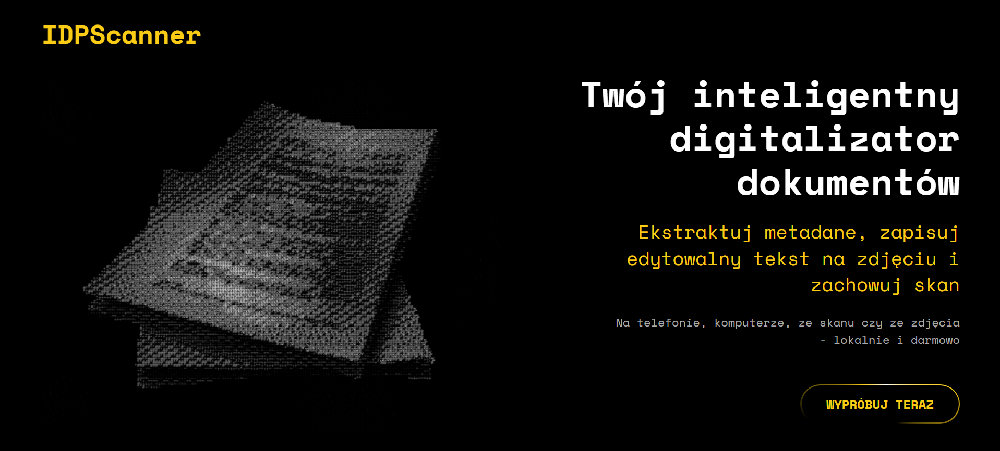
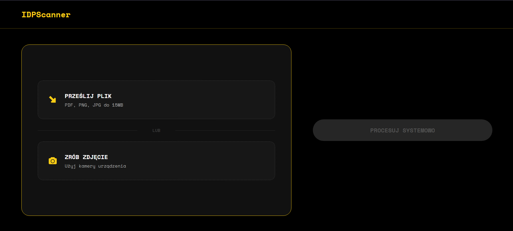
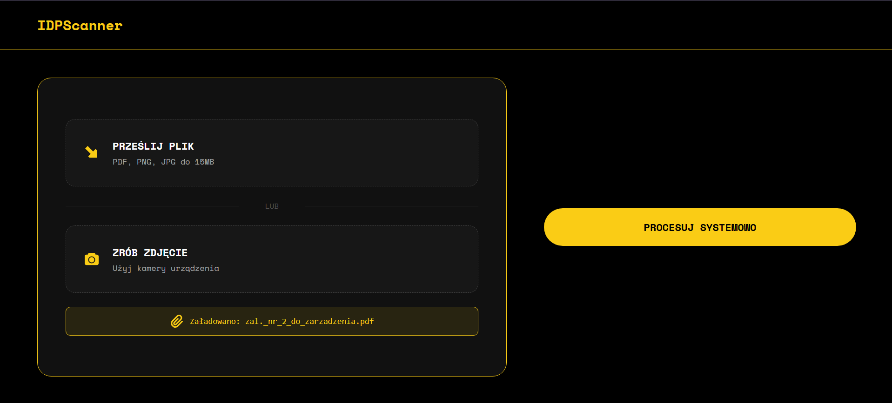
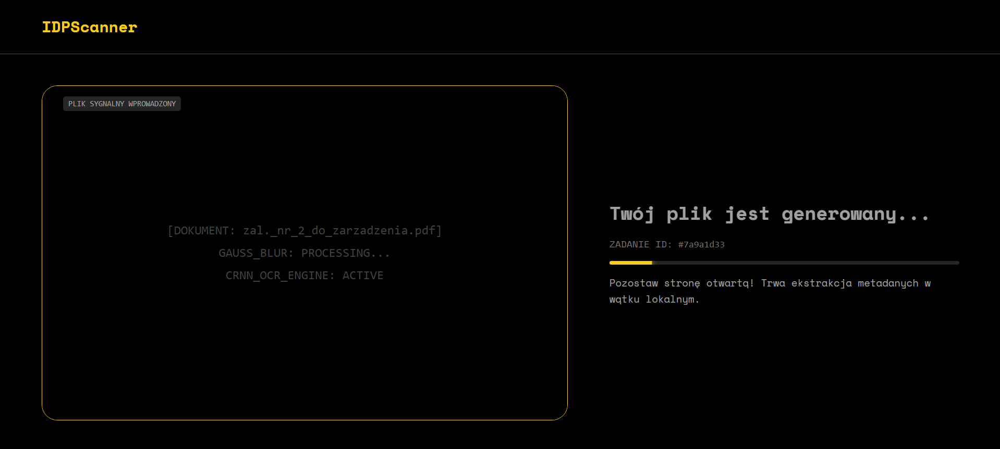
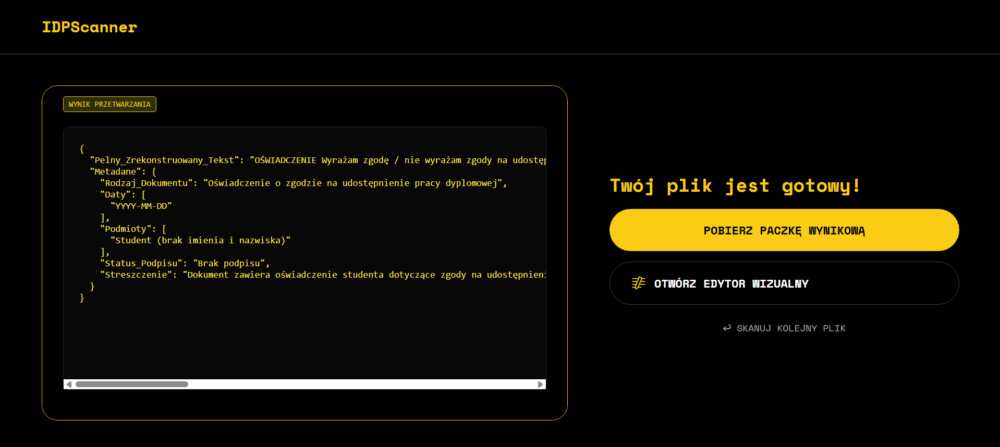
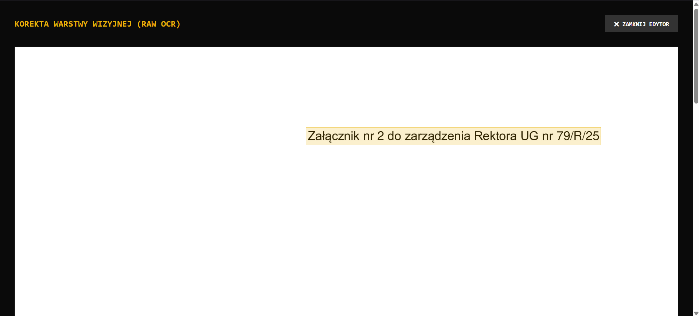
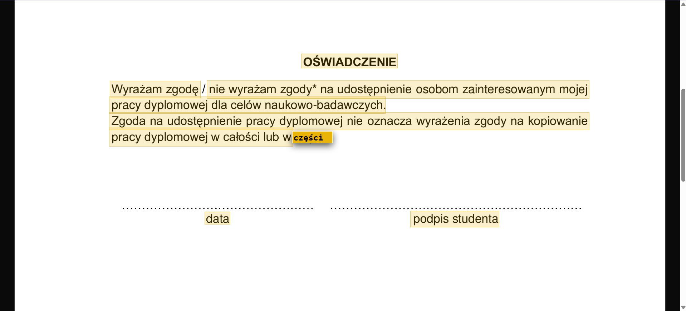

### 📱 Mobile Mode (Field Scanning)

* **Camera API Integration:** Dedicated UI flows for mobile devices allow users to capture documents directly via the native device camera.
* **Responsive UX:** Condensed dropzones and non-blocking `framer-motion` loader animations ensure a smooth experience during the heavy local background processing.
* **PWA Install Prompt:** Users can add IDPScanner to their home screen for a native-app-like experience, with no dependency on the App Store or Google Play.

| | | |
|:---:|:---:|:---:|
| 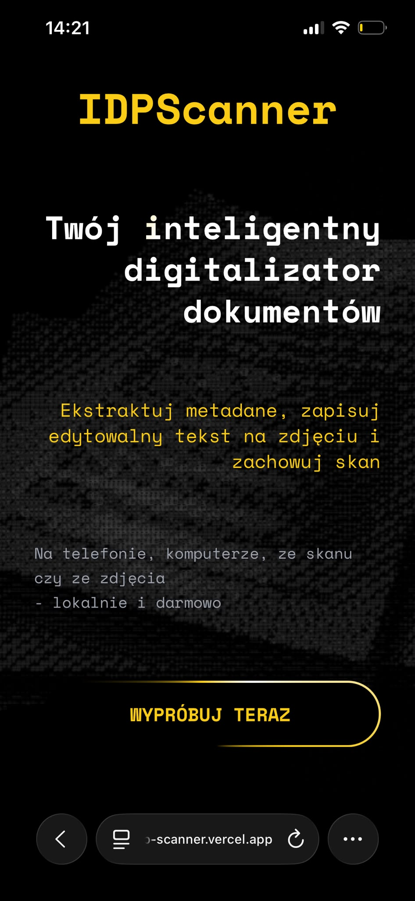 | 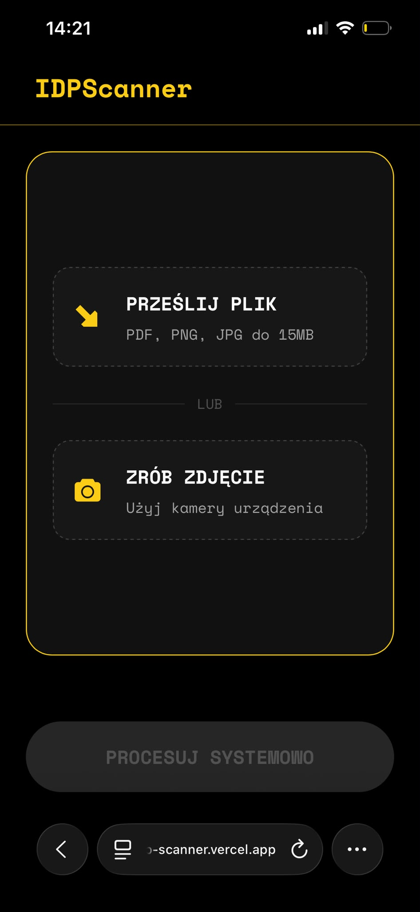 | 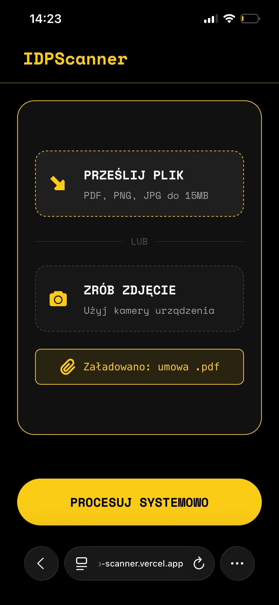 |
| 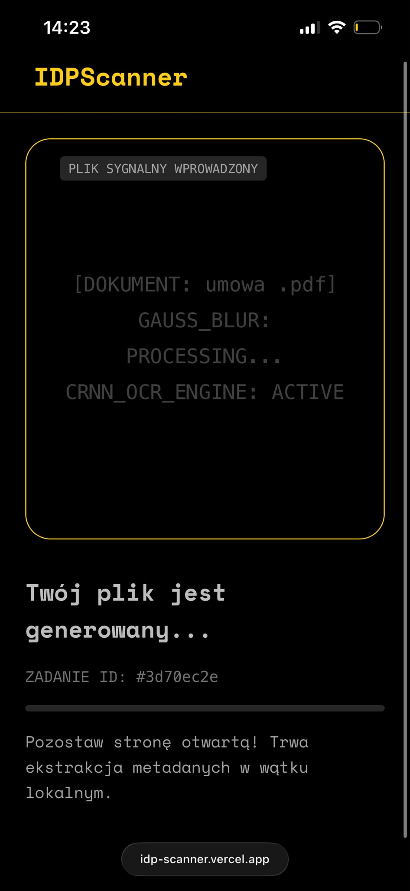 | 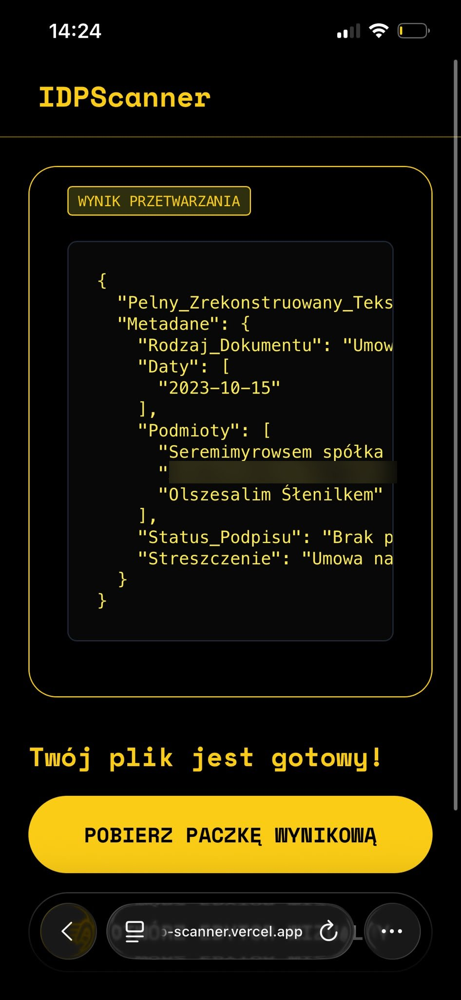 | 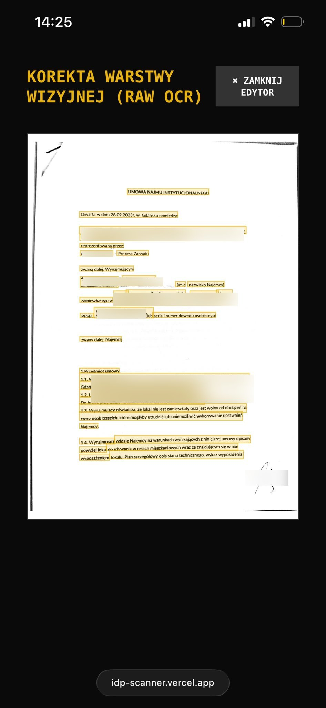 |
| 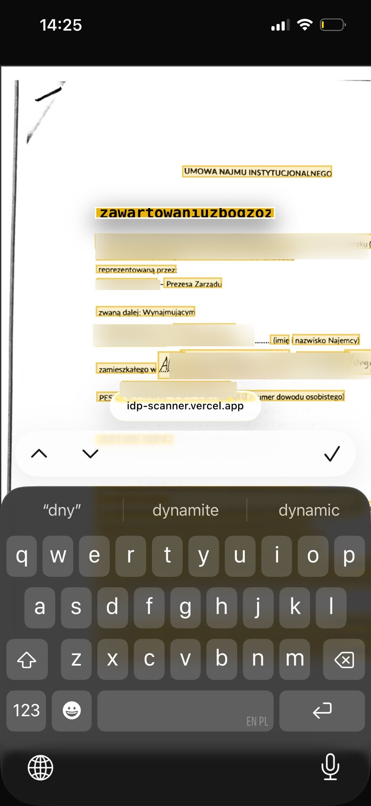 | | |


---

## Installation and Execution Guide

### 1. Start the Local Backend (FastAPI)

```bash
cd backend
python -m venv venv
source venv/bin/activate  # (Windows: venv\Scripts\activate)

pip install -r requirements.txt

# Initialize database
echo "DATABASE_URL=sqlite:///./idp_database.db" > .env

# Run server
uvicorn server:app --host 0.0.0.0 --port 8000
```

### 2. Establish Ngrok Tunnel

```bash
ngrok http 8000
# Copy the generated forwarding URL (e.g., https://xyz.ngrok-free.app)
```

### 3. Start the Frontend (React PWA)

```bash
cd frontend
npm install

# Configure API endpoint
echo "VITE_API_URL=https://xyz.ngrok-free.app" > .env

# Run development server
npm run dev
```

---

## 🇵🇱 Wersja Polska

---

## O projekcie

**IDPScanner** to zaawansowany system klasy IDP (Intelligent Document Processing) zaprojektowany specjalnie dla sektora MŚP (Małych i Średnich Przedsiębiorstw). Projekt stanowi pomost między systemami widzenia komputerowego (CV) a dużymi modelami językowymi (LLM), automatyzując proces cyfryzacji umów, oświadczeń i faktur.

Fundamentem filozofii tego projektu jest całkowita eliminacja zaporowych kosztów chmurowych (OpEx) przy jednoczesnym zagwarantowaniu bezkompromisowej ochrony danych (zgodność z RODO) poprzez zastosowanie paradygmatu Edge Computing.

---

## Architektura systemu (Hybrydowa)

Uruchomienie potężnych modeli takich jak Bielik-11b wraz z grafami obliczeniowymi PyTorch i silnikami OCR wymaga minimum 16 GB pamięci RAM/VRAM. W standardowych, niskobudżetowych środowiskach chmurowych natychmiast wyzwala to mechanizm jądra Linux **OOM Killer** (Out-Of-Memory) w fazie inicjalizacji.

Aby obejść ten problem bez zmuszania firm do kosztownego skalowania pionowego lub wydatków na infrastrukturę serwerową (CAPEX), IDPScanner wdraża architekturę hybrydową:

* **Lokalny Backend (Edge Computing):** Obliczenia wykonywane są na sprzęcie lokalnym przedsiębiorstwa (np. konsumenckie karty GPU). Dokumenty nie opuszczają fizycznej siedziby biura, co gwarantuje pełną zgodność z RODO.
* **Tunelowanie Ngrok:** Bezpiecznie wystawia lokalny port serwera Uvicorn (8000) do internetu, omijając firmowe zapory sieciowe (Firewall) i ograniczenia NAT (brak publicznego IP).
* **Frontend w Chmurze (Vercel):** Lekka, bezobsługowa aplikacja klasy **PWA (Progressive Web App)** w technologii React, którą użytkownik może zainstalować bezpośrednio z przeglądarki — bez udziału sklepów z aplikacjami.

---

## Dział techniczny (Algorytmy i potok ML)

### 1. Ekstrakcja cech wizyjnych (CRNN i Tesseract)

System stosuje dwusilnikowe podejście do odczytu danych:

* **Tesseract OCR:** Skuteczność dychotomiczna – marginalny błąd dla druku cyfrowego (1–2%), lecz całkowita porażka (szum maszynowy) przy piśmie odręcznym i strukturach tabelarycznych.
* **Autorski model CRNN:** Poddany procesowi douczania (fine-tuning) na bazach PHCD. Mimo niskiego wskaźnika błędu znaku (CER ~14%), analiza architektoniczna wykazała występowanie tzw. **ślepoty kerningowej** (kerning blindness). Sieć klasyfikowała znaki poprawnie, lecz ignorowała fizyczne odstępy. W świetle algorytmu Levenshteina prowadziło to do sklejania wyrazów w ciągi (np. `UMOWANAJMU`), windując wskaźnik błędu słowa (WER) do ponad 88%.

### 2. Rekonstrukcja kontekstowa (LLM Bielik-11b)

Silnik wykorzystuje model **Bielik-11b (wersja skwantowana Q4)** do niwelowania „ślepoty kerningowej" sieci splotowych. Działając jako semantyczny filtr generatywny, LLM rozdziela sklejone wyrazy, koryguje znaki diakrytyczne i wyodrębnia ustrukturyzowane informacje biznesowe (obiekt JSON).

### 3. Rozwiązanie „Problemu Utraconej Geometrii"

Transformacje dokonywane przez LLM (np. dodawanie spacji) trwale modyfikują długość jednowymiarowych ciągów znaków (indeksów), zrywając ich powiązanie z dwuwymiarowymi współrzędnymi przestrzennymi (bounding boxes) wygenerowanymi przez moduł wizyjny.

Aby rozwiązać ten problem, zaimplementowano wzorzec architektoniczny **Decoupled Persistence** (Rozprzęgnięcie warstw):

1. **Bifurkacja danych:** Baza SQLite przechowuje równolegle czysty obiekt biznesowy z LLM oraz surową tablicę wektorów geometrycznych z modułu OCR.
2. **Rekonstrukcja archiwalna:** Podczas eksportu paczki dowodowej, skrypt Python (PyMuPDF) pobiera skorygowaną przez operatora geometrię i „wypala" ją w pliku PDF/A-1b jako przezroczystą, przeszukiwalną warstwę tekstową (`render_mode=3`), zachowując idealną integralność dowodową.

---

## Warstwa frontendowa (Interfejs i UX)

Aplikacja kliencka (React + TypeScript) została zbudowana jako **Progressive Web App (PWA)**, umożliwiając instalację bezpośrednio z przeglądarki na urządzeniach desktopowych i mobilnych — bez pośrednictwa sklepów z aplikacjami. Posiada rygorystyczne typowanie i asynchroniczne zarządzanie stanem, co zapobiega zjawisku wąskiego gardła obliczeniowego (computational bottleneck).

### 🖥️ Tryb Desktopowy (Stacja Robocza)

* **Interaktywny Edytor Wizualny:** Interfejs nie jest statycznym obrazkiem. System dynamicznie rzutuje wektory geometrii na obiekt Blob reprezentujący skan, korzystając z pozycjonowania absolutnego.
* **Kontrolowane Komponenty (Controlled Components):** Operator edytuje tekst w polach `<input>` nałożonych na obraz. Korekta aktualizuje lokalny stan React, nie wyzwalając ponownego, kosztownego odpytywania modelu LLM.
* **Asynchroniczna Synchronizacja:** Zamknięcie edytora wyzwala żądanie `PUT`, które nadpisuje surową geometrię w bazie danych. Dzięki temu wygenerowany następnie plik PDF/A odzwierciedla wprowadzone manualnie poprawki.


### 📱 Tryb Mobilny (Skanowanie w terenie)

* **Integracja API aparatu:** Dedykowany interfejs dla urządzeń mobilnych pozwala na uruchomienie natywnego aparatu smartfona w celu natychmiastowej akwizycji dokumentu.
* **Optymalizacja UX:** Responsywne strefy dropzone oraz nieblokujące wątku głównego animacje ładujące (`framer-motion`), informujące użytkownika o asynchronicznym procesowaniu danych w tle.
* **Instalacja PWA:** Użytkownicy mogą dodać IDPScanner do ekranu głównego smartfona, uzyskując doświadczenie zbliżone do natywnej aplikacji — bez App Store i Google Play.

| | | |
|:---:|:---:|:---:|
|  |  |  |
|  |  |  |
|  | | |

---

## Instrukcja instalacji i uruchomienia

### 1. Uruchomienie lokalnego backendu (FastAPI)

```bash
cd backend
python -m venv venv
source venv/bin/activate  # (Dla Windows: venv\Scripts\activate)

pip install -r requirements.txt

# Inicjalizacja bazy danych
echo "DATABASE_URL=sqlite:///./idp_database.db" > .env

# Uruchomienie serwera
uvicorn server:app --host 0.0.0.0 --port 8000
```

### 2. Ekspozycja tunelu Ngrok

```bash
ngrok http 8000
# Skopiuj wygenerowany publiczny adres URL (np. https://xyz.ngrok-free.app)
```

### 3. Uruchomienie Frontendu (React PWA)

```bash
cd frontend
npm install

# Konfiguracja punktu dostępowego API
echo "VITE_API_URL=https://xyz.ngrok-free.app" > .env

# Uruchomienie serwera deweloperskiego
npm run dev
```

---

*Projekt zrealizowany jako inżynieryjna weryfikacja koncepcji (Proof of Concept) dla procesów automatyzacji w sektorze MŚP.*